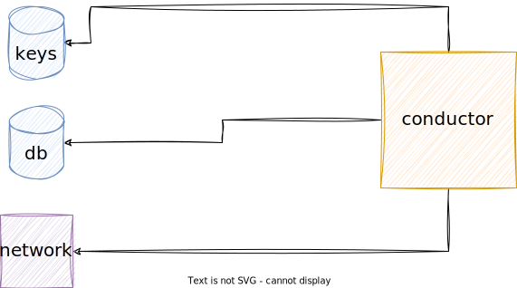

# Getting our feet wet

## What is Holochain?

Holochain is a distributed computing platform that enables the creation of decentralized applications (dApps) and peer-to-peer (P2P) interactions. It allows developers to build applications with data integrity, accountability, and autonomy, without relying on a centralized authority or infrastructure.

Holochain provides a framework for building dApps that run on individual nodes, with each node having its own local hash chain. This means that each node is responsible for validating its own data and interactions with other nodes in the network. The validation process is done using cryptographic techniques that ensure data integrity and authenticity.

The two main components of Holochain are 
1. the conductor and 
2. the networking module. 

The conductor is the runtime environment for dApps built on Holochain, and it provides the necessary interfaces for managing local data and interactions with other nodes. The Kitsune P2P module is a networking module that enables nodes to communicate and exchange data in a decentralized manner.

## What is a conductor?

The conductor plays a critical role in the functioning of Holochain and ensures that the hApps running on a node can interact with other nodes on the network in a secure and decentralized manner.

 In Holochain, the conductor is the runtime environment for running and managing the hApps (Holochain applications) that are installed on a node. It manages the storage of data, handles networking, and provides an interface for the hApp to interact with the node's local hash chain and the Holochain network.

The conductor is responsible for loading and executing the code of the hApps, as well as managing their state. It is also responsible for enforcing the validation rules that are defined by the hApp developers to ensure data integrity and security.

Each agent/user in Holochain has their own conductor, which is responsible for managing their interactions with the network. However, a single conductor can manage multiple hApps for a single agent. It is also possible to run multiple conductors on a single node for testing purposes or to serve multiple users/agents.

The `lair-keystore` module is a key management module in Holochain. It is responsible for securely storing the private keys used for digital signatures and cryptographic operations within the Holochain network.

Here is an example of a private key in Holochain:

`b3343e25d22369a742f1c4fe9ebe81ed7209ac5d7d1d596221acdd4b5814b5f8`

This is a 64-character string that represents a private key. The private key is typically generated randomly and securely stored in the lair-keystore module.

The private keys stored in the lair-keystore module are used to sign data and prove the authenticity of claims made by agents on the network. This helps to ensure data integrity and trustworthiness within the Holochain ecosystem.

Regarding the end-user perspective, a conductor in Holochain is a collection of cells. Each cell represents a unique instance of a hApp and is responsible for managing the data and interactions associated with that hApp. The conductor provides a runtime environment for the cells to interact with each other and with the Holochain network.

Cells are the primary building blocks of a Holochain application and are designed to be modular and composable. They can be combined to create more complex applications, with each cell providing its own unique functionality and data management capabilities.

